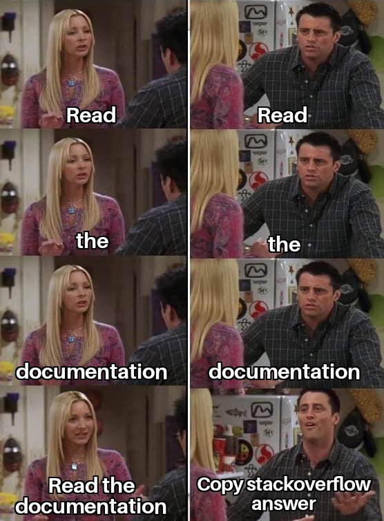
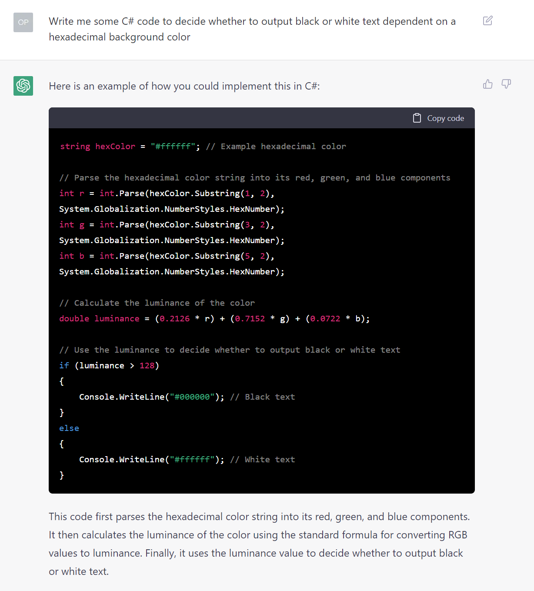

<!-- _class: copy-paste -->

<link rel="preconnect" href="https://fonts.googleapis.com" />
<link rel="preconnect" href="https://fonts.gstatic.com" crossorigin />
<link href="https://fonts.googleapis.com/css2?family=Shadows+Into+Light&display=swap" rel="stylesheet" />

<style>
    section.copy-paste h1 
    {
      & strong {
        color: inherit;
        text-shadow: -4em -4em 0px rgba(255,255,255,0.1),
                     -3em -3em 0px rgba(255,255,255,0.2),
                     -2em -2em 0px rgba(255,255,255,0.3),
                     -1em -1em 0px rgba(255,255,255,0.4)
                     ;
        font-family: var(--font-header)!important;
      }      
    }

    section.copy-paste p {
      margin-top: 2rem;
    }
</style>

# How to **Copy & Paste**
Effectively working with strangers <ins>and robots</ins> on the internet


<!-- Awkwardly highlight the "copy & paste" joke -->

<!-- ## CFP

Since the dawn of Forums, CodeProject and Stack Overflow - and more recently with Github, Discord, Youtube and blog posts - we've been building applications with strangers on the internet, copying and pasting other developers' code. And now with the advent of ChatGPT, GitHub CoPilot and other AI solutions, it's easier than ever to use code somebody (or something) else wrote... without necessarily understanding the code completely. We all copy and paste code, but a senior developer will often approach the task in different way to someone more junior. We'll look at how to level-up our Ctrl+V game through understanding the problem, assessing suitability and adapting code samples to meet our needs. Together, we can build something better and quicker... so long as we know what we're building. -->

<!-- _footer: Joe Glombek -->

---

## <small>Hello there,</small> Professional Googlers

<!--  -->

<!--
_footer: '"Surfing the web?" - Created with DALL-E'
-->

<!--
We've all heard that software developers are just "professional Googlers" - the more senior you are is mostly a product of how good you are at Googling.

It's a great joke... but have you tried being a developer _without_ internet access? It doesn't feel like much of a joke then, does it?

But I don't see this as a negative. When we're isolated we might feel weak and hopeless but as a team - a community - we're quick and efficient problem solvers. And that's where the idea for this talk came from: how can we work together more effectively as a worldwide developer community without getting stung along the way?
-->

---
<!-- _class: invert -->


## <small>Hello, my name is</small> Joe Glombek

<br />

- <i class="fad fa-fw fa-briefcase"></i><del>Professional Googler</del><ins>.NET Developer</ins> at Bump
- <i class="fad fa-fw fa-trophy-alt"></i>MVP for the Umbraco CMS
- <i class="fab fa-fw fa-meetup"></i>Meetup organiser

<br />

- <i class="fab fa-fw fa-mastodon"></i>[**@joe**@umbracocommunity.social](https://umbracocommunity.social/@joe)
- <i class="fad fa-fw fa-globe"></i>[www.**joe.gl**](https://joe.gl/ombek)

---
<!--
_class: invert
_footer: Emma Burstow on Umbraco collaboration: [go.joe.gl/yt-collab-joe-paul](https://go.joe.gl/yt-collab-joe-paul)
-->

## We're not **competitors**, we're a **community**

> It's not hippie stuff, it's actually logic


<!-- 
This photo is from after a Umbraco festival in the UK, when me and Paul (from Codeshare, creater of the Clean Starter Kit) went back to our hotel.
The aim was to grab a snack and get some sleep, but we accidentally ended up fixing some bugs in the Clean Starter Kit together!

In an open source world, we're much stronger together.

So we shouldn't be afraid to ask for help, and to offer our expertise to others.
 -->

---

## How can I **ask for help**?


<!--
_footer: 'Photo by <a href="https://unsplash.com/@anniespratt?utm_content=creditCopyText&utm_medium=referral&utm_source=unsplash">Annie Spratt</a> on <a href="https://unsplash.com/photos/boy-and-girl-playing-on-three-tree-log-9VpI3gQ1iUo?utm_content=creditCopyText&utm_medium=referral&utm_source=unsplash">Unsplash</a>'
-->

---

### **Where** to get help

<!-- Before we start with how and what to copy and paste, let's first start with some places we might find answers -  -->

#### **Google it first!**

* <i class="fa-fw fad fa-books"></i>Documentation
* <i class="fa-fw fab fa-youtube"></i>YouTube
  Demos, tutorials, talk recordings, etc
* <i class="fa-fw fad fa-blog"></i>Blog posts
* <i class="fa-fw fad fa-code"></i>Source code
* <i class="fa-fw fad fa-question-square"></i>Existing answers to other people's questions 




<!-- _footer: "[Image source: @VishalMalvi_@x.com (probably)](https://twitter.com/VishalMalvi_/status/1520026885626814464)" -->

---

#### So you need to **ask for help**?
If you can't find the answer you're looking for, it's time to ask for help.

* <i class="fa-fw fab fa-stack-overflow"></i>StackOverflow
* <i class="fa-fw fab fa-github"></i>Github?
* <i class="fa-fw fas fa-hands-helping"></i>Specialised communities
  What communities are you a part of? Forums, Discord, Slack, etc
* <i class="fa-fw fab fa-mastodon"></i>Social media
  Mastodon/X/Reddit/etc

<!--
StackOverflow - good for more generic development questions
Github? - some repositories have discussions or issues may be appropriate
Umbraco Forum - specific to Umbraco
Discord - specific to Umbraco
Mastodon/X/Facebook
-->

---

### *How* to **ask for help**

How can we ask for help in a way that's most likely to get the best possible answer?

<!--
How can we ask for help in a way that's most likely to get the best possible answer?

Although the community is very helpful, it't to our own benefit to ask the right questions in the right places.
-->

* <i class="fa-fw fad fa-search"></i>Do your **research** *first*
* <i class="fa-fw fad fa-head-side-brain"></i>**Comprehend** the problem (<i class="fad fa-duck"></i>)
* <i class="fa-fw fad fa-hands-heart"></i>**Be polite** and patient - nobody _has_ to help you
* <i class="fa-fw fad fa-tags"></i>**On-topic** and suitable (including tags, categories, etc)
* <i class="fa-fw fad fa-clipboard-list"></i>**Summarize** your problem
* <i class="fa-fw fad fa-code"></i>[Include a **reproducible** example <small><i class="fa-fw fa fa-external-link"></i></small>](https://stackoverflow.com/help/minimal-reproducible-example)

<!-- 

Do your research *first* 
Although you've already searched for an answer to your question, it's also important we do some background research so we can explain ourselves correctly and be very specific about our problem.

Comprehend the problem
There's very little point in asking a question if we don't know what we're asking. If we don't understand what we're asking we need to ask a different question
Comprehend here basically means "understand", but I feel it emphasises we don't need to *understand* everything, just *comprehend* what we *wan't* to understand.

Be polite and patient - nobody _has_ to help you

On-topic and suitable (including tags, categories, etc)

Summarize your problem

Include a reproducible example

---

We know this is good advice, because it inspired by StackOverflow. And if anybody is fussy about how you ask a question, it's them! -->

<!-- _footer: Inspired by: https://stackoverflow.com/help/how-to-ask -->

---

### <small>What is</small>Rubber ducking<ins>AKA "Savaging from behind"</ins>?

<!--
As a junior fresh-out-of-his-apprenticeship developer, I had a boss called Mr Savage.
We'd often call him over to ask him questions, only to have the answer immediately present itself without him saying a word.

We called this "Savaging from behind" - all he had to do was stand behind us and the problem was solved.

Other developers have discovered this solution, but not all of them had a Mr Savage!

They had to settle for a rubber duck on their desk (or anything with a face, really)

The idea:
forming your questions into actual verbalised queries
providing context 
out loud
can help yourself to better understand a problem
come up with a solution

This can really help with the "comprehend the problem" step

-->

<!-- ### **<i class="fad fa-duck"></i>** -->


<!--
_footer: '"A ducking great work ethic", Created with DALL-E'
-->

---

### **What** to ask **where**
Some questions lend themselves to specific environments.

* <i class="fa-fw fad fa-comments-alt"></i>Vague or conceptual question, hand holding
  * > How might I go about implementing a...?
  * Suited to a chat format, like Discord or Slack
* <i class="fa-fw fad fa-poll"></i>Opinionated or niche question
  * > Which is more performant...?
  * Get a quorum by asking on social media
* <i class="fa-fw fad fa-align-left"></i>Technical or specific question
  * > I'm trying to do this by ... but I'm getting an error...
  * A forum or StackOverflow might be better suited

<!--

Discord - one person can ask questions to help work out what you need
Social media - lots of people can chime in with their opinions and experiences
Forum - tend to be longer questions with longer answers
-->

---

<!-- _footer: https://discord-chats.umbraco.com/t/15854045/solved-backoffice-in-block-list-show-image-name-in-label -->
### Let's look at an example

<iframe src="https://discord-chats.umbraco.com/t/15854045/solved-backoffice-in-block-list-show-image-name-in-label" title="Question from Discord">
  <a href="https://discord-chats.umbraco.com/t/15854045/solved-backoffice-in-block-list-show-image-name-in-label">Question from Discord</a>
</iframe>

<!--

Do your research: Read my blog post
Understand the problem: detailed, said what he's tried
Be polite: Flattery will get you everywhere! Friendly, sociable, "TIA"
On topic & suitable: Umbraco Discord, help-with-umbraco channel, hoping for a quick, short reply (it actually helped us chat it over and try things out without me needing to replicate)
Summarize your problem: Pictures! "I would like to..."
Reproducible example: Provided Umbraco version, media picker version, exact setup - I could do this!

-->

---

<!-- > Happy Monday!
> In the backoffice (v10) I have a block list editor with image rows. That image row has an Image Media Picker, with the alias "image". I would like to show the name of that image in the block list editor's label for that row.
> I have tried label values such as Image: `{{ image.name }}` and `Image: {{ image }}` but to no joy. Fields such as "caption" can be accessed happily though `{{ caption }}`, the problem arises because image is an Umbraco.MediaPicker3 and I'm trying to access the name of that specific piece of picked media (3).
> I have scoured @Joe Glombek's EXCELLENT [blog post](https://joe.gl/ombek/blog/umbraco-angularjs-filter-cheat-sheet) but alas I am without results.
> Please do consider helping a boy out on a cold, autumnal Monday morning.
> TIA!

--- -->

## Improvable question

This is someone's first StackOverflow question - it's not necessarily a **bad** question, but we could improve it.


---


* <i class="fa-fw fad fa-search"></i>**Research:** None clear. Did they already search for solutions? Why was this not suitable?
* <i class="fa-fw fad fa-head-side-brain"></i>**Comprehend:** Doesn't grasp key concepts of SSO
* <i class="fa-fw fad fa-tags"></i>**On-topic:** Is `navicat` an appropriate tag?
* <i class="fa-fw fad fa-clipboard-list"></i>**Summarize:** Unclear what the problem is and what solution they want.
* <i class="fa-fw fad fa-code"></i>**Reproducible:** Not enough information for me to build this myself and see how they're stuck.

---

How might we fix this?

> ### Using a self-hosted OAuth server with ASP.NET MVC
> I have an OAuth server configured ([using the AuthU Package with an Umbraco install](https://github.com/mattbrailsford/umbraco-authu)) and I'm having issues connecting with it from an ASP.NET MVC website.
> 
> I've tried registering the OAuth server in `Startup.cs`:
> ```
> services.AddAuthentication(...)
> ```
> But I get the following error:
> ```
> An Exception of type MadeUpAsAnExampleException was thrown...
> ```
>
> <i class="fa-fw fad fa-tags"></i> `asp.net` `asp.net-mvc` `oauth` `asp.net-identity`

---

## What about **AI**?

AI is an other place we can ask questions for help.

* <i class="fa-fw fad fa-mind-share"></i>**Our** programs and **our** code samples
* <i class="fa-fw fad fa-people-carry"></i>Effectively **built by the community**
* <i class="fa-fw fad fa-medal"></i>You need **the same skills** to effectively use AI as for human-generated answers


<!-- We've been talking a lot about community and collaboration - so why am I brining up artificial intelligence? Is it because I want this talk to sound topical and modern? Well... yes. But only in part!

AI has been scouring the internet looking at _our_ programs and _our_ code samples. As I see it, AI is a tool built by the community. And it takes a lot of the same skills to effectively use AI generated code as it does to pick the right Stack Overflow answer. -->

---

### AI tooling

- <i class="fa-fw fad fa-bolt"></i>ChatGPT (OpenAI or Bing)
- <i class="fa-fw fab fa-github"></i>Github Copilot <small><i class="fad fa-badge-dollar"></i></small>
- <i class="fa-fw fad fa-sparkles"></i>Google Gemini

---

### What can I ask AI to do?

* <i class="fa-fw fad fa-play"></i>A **starting point** for:
  * <i class="fa-fw fad fa-comment-alt-dollar"></i>Regular expressions
    > Write me a regular expression for UK phone numbers
  * <i class="fa-fw fad fa-code"></i>Generic coding questions
* <i class="fa-fw fad fa-magic"></i>**Autocomplete** of common structures and repeating patterns
* <i class="fa-fw fad fa-chalkboard"></i>**Explaining** code samples and error messages
* <i class="fa-fw fad fa-transporter-2"></i>**Converting** from one format to another
  > Convert the following XML file into JSON
* <i class="fad fa-duck"></i> Be my **rubber duck**

---

<video src="images/ai-rubber-duck.mp4" style="max-height:100%; width:32.2%;margin:auto;" controls="controls" />


<!--
Let's see how Scott Hanselman uses AI to rubber duck

[Play video]

You know what AI is also good at? Generating pictures of rubber ducks in an office setting...
-->

---

<!--
You know what AI is also good at? Generating pictures of rubber ducks in an office setting...
-->


---

<!--
You know what AI is also good at? Generating pictures of rubber ducks in an office setting...
-->


---

<!--
...or rubber ducks using humans as rubber ducks
-->


---

### When might I want to ask elsewhere?

* <i class="fa-fw fad fa-tachometer-alt-slowest"></i>Poor understanding of performance
* <i class="fa-fw fad fa-sparkles"></i>Understanding versions
  - .NET Framework vs .NET "Core"
  - Angular vs AngularJS
* <i class="fa-fw fad fa-sync-alt"></i>Often inverts boolean logic?!
* <i class="fa-fw fad fa-edit"></i>Can struggle with modifications
  > Write me a regular expression for international phone numbers
  > Don't people in the US often hyphenate their phone numbers?
* <i class="fa-fw fad fa-hand-holding-magic"></i>Makes things up
* <i class="fa-fw fad fa-question"></i> It will never ask questions or give options

<!--

Makes things up: AI will rarely tell you that you can't do something. It will generally make up ways you can... even if those ways are not possible and use API methods that simply don't exist.
-->

---


# **ChatGPT** making things up

---

![bg contain
ChatGPT screenshot.
User:
Create an Apple Shortcuts automation to put my phone into a focus mode called "Sleep" when the phone is charging between 9pm and 8am
ChatGPT:
Open the Shortcuts app on your iPhone.
Tap on the "Automation" tab at the bottom.
Tap on the "+" icon to create a new automation.
Choose the "Charger" trigger.
Toggle on "Is Connected".
Tap on "Next".
Tap on "Add Action".
Search for and select the "Set Focus" action.
Tap on the "Focus" field and select or create a focus mode called "Sleep".
Tap on "Next".
Toggle on "Time of Day".
Set the start time to 9 PM and the end time to 8 AM.
Tap on "Next".
Toggle off "Ask Before Running".
Tap on "Done" to save the automation.
Now, whenever your phone is connected to the charger between 9 PM and 8 AM, it will automatically activate the "Sleep" focus mode.
](images/apple-shortcuts/image1.png)

---


---


---

<!-- So, you've asked a question and got an answer. -->


## <small>Now we need to know&hellip;</small> How to Copy & Paste


<!-- _footer: "🎉 *(Roll credits...)*" -->

---

<!-- _class: invert -->
We've established AI can be wrong.

### AI learns from **people**,<br> People are **wrong too**.

---

### Copy & Pasting vs. Comprehending

* <i class="fad fa-fw fa-head-side-brain"></i>Human or robot, we need to **understand** what we're copying into our projects
* <i class="fad fa-fw fa-user-chart"></i>Big indicator of **seniority**
* <i class="fad fa-fw fa-cogs"></i>We don't need to understand every intricacy of the code, but we should have an ***idea*** line-by-line what it's doing


---

### Assessing **Suitability** of a **Solution**


<!-- _footer: 'Photo by [Agence Olloweb](https://unsplash.com/@olloweb?utm_source=unsplash&utm_medium=referral&utm_content=creditCopyText) on Unsplash' -->
---

<!-- Example: searching for a way to add asterisk to fields without extra markup -->

<p style="border:1px solid currentColor; border-radius: 10em; padding: 0.25em;"><i class="fa-fw fad fa-search"></i> add asterisk to required fields without additional markup</p>

<!--
Come across this stack overflow answer

Uses background image on the input to draw an image of an asterisk.

If we didn't know better (or think it through) this is a valid solution to the question
-->

> A similar outcome could be achieved by using a background image of a picture of an asterisk and setting the background of the label/input/the outer div and a padding of the size of the asterisk image. Something like this:
>
> ```
> .required input {
>   padding-right: 25px;
>   background-image: url(...);
>   background-position: right top;
> }
> ```
>
> This will put the asterisk INSIDE the text box, but putting the same on `div.required` instead of `.required input` will probably be more what you're looking for, if a little less elegant. This method doesn't require an additional input.

---

<!--
Look at the question
they're asking a different question!

They're saying the *more correct* solution doesn't work for them.

May sound like a contrived answer to question
It's real
I answered it
-->

![bg contain Stack Overflow questions screenshot reading:
What is a good way to overcome the unfortunate fact that this code will not work as desired:
&lt;div class=&quot;required&quot;&gt;
    &lt;label&gt;Name:&lt;/label&gt;
    &lt;input type=&quot;text&quot;&gt;
&lt;/div&gt;
&lt;style&gt;
    .required input:after { content:&quot;*&quot;; }
&lt;/style&gt;
In a perfect world, all required inputs would get the little asterisk indicating that the field is required. This solution impossible since the CSS is inserted after the element content, not after the element itself, but something like it would be ideal. On a site with thousands of required fields, I can move the asterisk in front of the input with one change to one line (:after to :before) or I can move it to the end of the label (.required label:after) or in front of the label, or to a position on the containing box, etc...
This is important not just in case I change my mind about where to place the asterisk everywhere, but also for odd cases where the form layout doesn't allow the asterisk in the standard position. It also plays well with validation that checks the form or highlights improperly completed controls.
Lastly, it doesn't add additional markup.
Are there any good solutions that have all or most of the advantages of the impossible code?](images/suitability-of-solution/question.png)

---

<!-- 
That's my answer!

Kept getting upvotes for it.

I know there's no way that was the correct answer for anyone else.
They've been Googling like we said and come across my *marked as solution* answer!

Added a comment to highlight better solutions

Then edited the answer to highlight the better solution

Then made that warning big and bold

Then finally gave in and deleted my answer!

It was the right answer for this person, but others were mistaking it for their correct answer **SO OFTEN**
 -->


---

### <small>Joe's guide to</small>Assessing suitability


<!-- 
So here's Joe's guide to comprehending and assessing suitability.

- Answer Q?
  - Does the answer make sense as a response to my question?
  - Could've misread/misunderstood
  - Is my question the same one as being answered?
  - If reading someone elses question

- Line by line
  - If it's a code solution, what does each line do?
  - We don't need to understand every intricacy of the code,
    but we should have an ***idea*** line-by-line what it's doing

- Match description
  - Does a written description match up with what the code does?
  - If not - bad smell!

- Feel right
  - How's the gut feel?
  - What existing knowledge can we apply?

- Increase confidence
  - What else could we ask or look up to reassure us?
 -->

* <i class="fa-fw fad fa-question"></i>Does it **answer my question**?
* <i class="fa-fw fad fa-file-search"></i>**Line by line**, what is this doing?
* <i class="fa-fw fad fa-swatchbook"></i>Does the **code match the description**?
* <i class="fa-fw fad fa-hand-heart"></i>Does that **_feel right_**?
* <i class="fa-fw fad fa-smile-plus"></i>How can we **increase our confidence** in this answer?

---

<!-- 
Applied to my last 
- Answer Q? - No, answering a different one
- Line by line - adding an image
- Match description - yes
- Feel right - NO! Background knowledge - There's no semantics here, background images not readable by a screen reader
- Increase confidence - no need, we've already failed! Could look up semantics of required fields

Let's look at another example...
 -->

* <i class="fa-fw fad fa-question"></i>Does it answer my question?
* <i class="fa-fw fad fa-file-search"></i>Line by line
* <i class="fa-fw fad fa-swatchbook"></i>Code matches description?
* <i class="fa-fw fad fa-hand-heart"></i>_Feels_ right?
* <i class="fa-fw fad fa-smile-plus"></i>Increase confidence

![bg left contain
A similar outcome could be achieved by using a background image of a picture of an asterisk and setting the background of the label/input/the outer div and a padding of the size of the asterisk image. Something like this:
.required input {
   padding-right: 25px;
   background-image: url(...);
   background-position: right top;
}
This will put the asterisk INSIDE the text box, but putting the same on div.required instead of .required input will probably be more what you're looking for, if a little less elegant.
This method doesn't require an additional input.
](images/suitability-of-solution/original.png)

---

* <i class="fa-fw fad fa-question"></i>Does it answer my question?
* <i class="fa-fw fad fa-file-search"></i>Line by line
* <i class="fa-fw fad fa-swatchbook"></i>Code matches description?
* <i class="fa-fw fad fa-hand-heart"></i>_Feels_ right?
* <i class="fa-fw fad fa-smile-plus"></i>Increase confidence

![bg left fit Screenshot of a ChatGPT interaction. The prompt reads "Write me some C# code to decide whether to output black or white text dependent on a hexadecimal background color" and the answer includes a code sample with the explanation "This code first parses the hexadecimal color string into its red, green, and blue components. It then calculates the luminance of the color using the standard formula for converting RGB values to luminance. Finally, it uses the luminance value to decide whether to output black or white text."](images/chatgpt-luminance.png)


<!--

Does it answer my question?
Read Q and A

Line by line, what is this doing?
- takes a hex string value
- splits out R/G/B values
- converts them from hex to int
- calculates a "luminance"
- checks for luminance value (128 = 256/2)

Does the code match the description?
The code seems to match up with the description

Does that _feel_ right?
- things I don't fully understand
- generally somewhat like I was expecting
- I didn't know the hex conversion function existed, but it seems right

How can we increase our confidence in this answer?

Most useful info: I now know I want to calculate the luminance.
So now I can go away and validate the luminance formula (which it got right!) and we're away!
I can also check luminance is 
-->

---

### Dry run testing

> The programmer would sit down [...] and manually follow the value of a variable to check that it was used and updated as expected


<!-- 
_footer: '[BBC Bitesize: Dry run - Testing - Higher Computer Science](https://www.bbc.co.uk/bitesize/guides/zg4j7ty/revision/3)

Photo by [Jed Villejo](https://unsplash.com/@jmvillejo?utm_source=unsplash&utm_medium=referral&utm_content=creditCopyText) on Unsplash'
   -->

---

```
hexColor = "#ffffff"

r = "ff" = 256
g = "ff" = 256
b = "ff" = 256

luminance ≈ (0.2 * 265) + (0.7 * 256) + (0.1 * 256)
          ≈      53     +     180     +      26
          ≈ 261

261 > 128

result = "#000000"
```


```
hexColor = "#1b264f"

r = "1b" = 27
g = "26" = 38
b = "4F" = 79

luminance ≈ (0.2 * 27) + (0.7 * 38) + (0.1 * 79)
          ≈      5    +     27    +      8
          ≈ 40

40 < 128

result = "#FFFFFF"
```



---

## Adapting Code to Meet Needs

When we understand the code, we can tweak it to our needs

We'd all have a better idea of how to modify the previous example to, for example:

* Enforce accessibility contrast levels
* Change the resulting colours (not black/white)
* Extract this method into smaller reusable helper methods

---

## Considering Performance

* <i class="fa-fw fad fa-tachometer"></i> Do we always want the "most performant" answer?
* <i class="fa-fw fad fa-brain"></i> Legibility can be more important
* <i class="fa-fw fad fa-comments-alt"></i>You don't always need to get caught up in a debate about the "best" way to do something
* <i class="fa-fw fad fa-repeat"></i>Consider performance based on the context and frequency of code execution
  - code running once a day
  - code running 100 times per second
* <i class="fa-fw fad fa-function"></i> Consider the complexity of a solution
  - loops
  - nested loops
  - LINQ

---


## <small>How to</small> Copy & Paste
- <i class="fa-fw fad fa-search"></i>**Google** it!
- <i class="fa-fw fad fa-question"></i>Ask the **best** people (or robots) in the **best** place in the **best** way
- <i class="fa-fw fad fa-box"></i>Know **what** and **why** you're asking (<i class="fad fa-duck"></i>)
- <i class="fa-fw fad fa-brain"></i>**Understand** and **validate** the answer
- <i class="fa-fw fad fa-edit"></i>**Adapt** to meet your needs

---

<!-- _class: invert -->


## Thank you

- <i class="fab fa-fw fa-mastodon"></i>[**@joe**@umbracocommunity.social](https://umbracocommunity.social/@joe)
- <i class="fad fa-fw fa-globe"></i>[www.**joe.gl**](https://joe.gl/ombek)

Slides:
- <i class="fad fa-fw fa-presentation"></i>[slides.joe.gl/**how-to-copy-and-paste**](https://slides.joe.gl/how-to-copy-and-paste/)